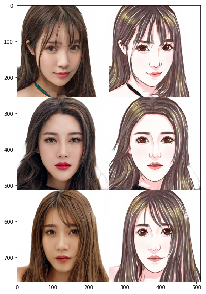

# My Result Demo after 10000 iterations


# 七日课 大作业：实现超分

经过这几天的学习，相信大家对GAN已经有了一定的了解了，也在前面的作业中体验过GAN的一些应用了。那现在大家是不是想要升级一下难度，自己动手来训练一个模型呢？

需要自己动手训练的大作业来啦，大作业内容为基于PaddleGAN中的超分模型，实现卡通画超分。


## 安装PaddleGAN

PaddleGAN的安装目前支持Clone GitHub和Gitee两种方式：


```python
# 安装ppgan
# 当前目录在: /home/aistudio/, 这个目录也是左边文件和文件夹所在的目录
# 克隆最新的PaddleGAN仓库到当前目录
# !git clone https://github.com/PaddlePaddle/PaddleGAN.git
# 如果从github下载慢可以从gitee clone：
!git clone https://gitee.com/paddlepaddle/PaddleGAN.git
# 安装Paddle GAN
%cd PaddleGAN/
!pip install -v -e .
```

    Removed build tracker '/tmp/pip-req-tracker-keh__e9p'

### 数据准备
我们为大家准备了处理好的超分数据集[卡通画超分数据集](https://aistudio.baidu.com/aistudio/datasetdetail/80790)


```python
# 回到/home/aistudio/下
%cd /home/aistudio
# 解压数据
!unzip -q data/data80790/animeSR.zip -d data/
# 将解压后的数据链接到` /home/aistudio/PaddleGAN/data `目录下
!mv data/animeSR PaddleGAN/data/
```

    /home/aistudio


### 数据集的组成形式
```
    PaddleGAN
      ├── data
          ├── animeSR
                ├── train
                ├── train_X4
                ├── test
                └── test_X4
  ```

训练数据集包括400张卡通画，其中``` train ```中是高分辨率图像，``` train_X4 ```中是对应的4倍缩小的低分辨率图像。测试数据集包括20张卡通画，其中``` test ```中是高分辨率图像，``` test_X4 ```中是对应的4倍缩小的低分辨率图像。

### 数据可视化


```python
import os
import cv2
import numpy as np
import matplotlib.pyplot as plt
# 训练数据统计
train_names = os.listdir('PaddleGAN/data/animeSR/train')
print(f'训练集数据量: {len(train_names)}')

# 测试数据统计
test_names = os.listdir('PaddleGAN/data/animeSR/test')
print(f'测试集数据量: {len(test_names)}')

# 训练数据可视化
img = cv2.imread('PaddleGAN/data/animeSR/train/Anime_1.jpg')
img = img[:,:,::-1]
plt.figure()
plt.imshow(img)
plt.show()
```

    训练集数据量: 400
    测试集数据量: 20





### 选择超分模型

PaddleGAN中提供的超分模型包括RealSR, ESRGAN, LESRCNN, DRN等，详情可见[超分模型](https://github.com/PaddlePaddle/PaddleGAN/blob/develop/docs/zh_CN/tutorials/super_resolution.md)。

接下来以ESRGAN为例进行演示。

### 修改配置文件
 所有模型的配置文件均在``` /home/aistudio/PaddleGAN/configs ```目录下。
 
 找到你需要的模型的配置文件，修改模型参数，一般修改迭代次数，num_workers，batch_size以及数据集路径。有能力的同学也可以尝试修改其他参数，或者基于现有模型进行二次开发，模型代码在``` /home/aistudio/PaddleGAN/ppgan/models ```目录下。
 
 以ESRGAN为例，这里将将配置文件``esrgan_psnr_x4_div2k.yaml``中的
 
 参数``total_iters``改为50000
 
 参数``dataset：train：num_workers``改为12
 
 参数``dataset：train：batch_size``改为48
 
 参数``dataset：train：gt_folder``改为data/animeSR/train
 
 参数``dataset：train：lq_folder``改为data/animeSR/train_X4
 
 参数``dataset：test：gt_folder``改为data/animeSR/test
 
 参数``dataset：test：lq_folder``改为data/animeSR/test_X4
 

### 训练模型
以ESRGAN为例，运行以下代码训练ESRGAN模型。

如果希望使用其他模型训练，可以修改配置文件名字。


```python
%cd /home/aistudio/PaddleGAN/
!python -u tools/main.py \
        --config-file configs/esrgan_psnr_x4_div2k.yaml \
        --resume output_dir/esrgan_psnr_x4_div2k-2021-04-20-09-44/iter_10000_checkpoint.pdparams
```

    /home/aistudio/PaddleGAN
    /opt/conda/envs/python35-paddle120-env/lib/python3.7/site-packages/setuptools/depends.py:2: DeprecationWarning: the imp module is deprecated in favour of importlib; see the module's documentation for alternative uses
      import imp


### 测试模型
以ESRGAN为例，模型训练好后，运行以下代码测试ESRGAN模型。

其中``/home/aistudio/pretrained_model/ESRGAN_PSNR_50000_weight.pdparams``是刚才ESRGAN训练的模型参数，同学们需要换成自己的模型参数。

如果希望使用其他模型测试，可以修改配置文件名字。


```python
%cd /home/aistudio/PaddleGAN/
# !python tools/main.py --config-file configs/esrgan_psnr_x4_div2k.yaml --evaluate-only --load /home/aistudio/pretrained_model/ESRGAN_PSNR_50000_weight.pdparams
!python tools/main.py --config-file configs/esrgan_psnr_x4_div2k.yaml --evaluate-only --load /home/aistudio/PaddleGAN/output_dir/esrgan_psnr_x4_div2k-2021-04-20-09-44/iter_10000_weight.pdparams
```

    /home/aistudio/PaddleGAN
    /opt/conda/envs/python35-paddle120-env/lib/python3.7/site-packages/setuptools/depends.py:2: DeprecationWarning: the imp module is deprecated in favour of importlib; see the module's documentation for alternative uses
      import imp
    [04/20 13:05:03] ppgan INFO: Configs: {'total_iters': 10000, 'output_dir': 'output_dir/esrgan_psnr_x4_div2k-2021-04-20-13-05', 'min_max': (0.0, 1.0), 'model': {'name': 'BaseSRModel', 'generator': {'name': 'RRDBNet', 'in_nc': 3, 'out_nc': 3, 'nf': 64, 'nb': 23}, 'pixel_criterion': {'name': 'L1Loss'}}, 'dataset': {'train': {'name': 'SRDataset', 'gt_folder': 'data/animeSR/train', 'lq_folder': 'data/animeSR/train_X4', 'num_workers': 4, 'batch_size': 16, 'scale': 4, 'preprocess': [{'name': 'LoadImageFromFile', 'key': 'lq'}, {'name': 'LoadImageFromFile', 'key': 'gt'}, {'name': 'Transforms', 'input_keys': ['lq', 'gt'], 'pipeline': [{'name': 'SRPairedRandomCrop', 'gt_patch_size': 128, 'scale': 4, 'keys': ['image', 'image']}, {'name': 'PairedRandomHorizontalFlip', 'keys': ['image', 'image']}, {'name': 'PairedRandomVerticalFlip', 'keys': ['image', 'image']}, {'name': 'PairedRandomTransposeHW', 'keys': ['image', 'image']}, {'name': 'Transpose', 'keys': ['image', 'image']}, {'name': 'Normalize', 'mean': [0.0, 0.0, 0.0], 'std': [255.0, 255.0, 255.0], 'keys': ['image', 'image']}]}]}, 'test': {'name': 'SRDataset', 'gt_folder': 'data/animeSR/test', 'lq_folder': 'data/animeSR/test_X4', 'scale': 4, 'preprocess': [{'name': 'LoadImageFromFile', 'key': 'lq'}, {'name': 'LoadImageFromFile', 'key': 'gt'}, {'name': 'Transforms', 'input_keys': ['lq', 'gt'], 'pipeline': [{'name': 'Transpose', 'keys': ['image', 'image']}, {'name': 'Normalize', 'mean': [0.0, 0.0, 0.0], 'std': [255.0, 255.0, 255.0], 'keys': ['image', 'image']}]}]}}, 'lr_scheduler': {'name': 'CosineAnnealingRestartLR', 'learning_rate': 0.0001, 'periods': [2500, 2500, 2500, 2500], 'restart_weights': [1, 1, 1, 1], 'eta_min': 1e-07}, 'optimizer': {'name': 'Adam', 'net_names': ['generator'], 'beta1': 0.9, 'beta2': 0.99}, 'validate': {'interval': 100, 'save_img': False, 'metrics': {'psnr': {'name': 'PSNR', 'crop_border': 4, 'test_y_channel': True}, 'ssim': {'name': 'SSIM', 'crop_border': 4, 'test_y_channel': True}}}, 'log_config': {'interval': 10, 'visiual_interval': 50}, 'snapshot_config': {'interval': 50}, 'is_train': False, 'timestamp': '-2021-04-20-13-05'}
    W0420 13:05:03.397805 18596 device_context.cc:362] Please NOTE: device: 0, GPU Compute Capability: 7.0, Driver API Version: 10.1, Runtime API Version: 10.1
    W0420 13:05:03.403662 18596 device_context.cc:372] device: 0, cuDNN Version: 7.6.
    [04/20 13:05:09] ppgan.engine.trainer INFO: Loaded pretrained weight for net generator
    [04/20 13:05:12] ppgan.engine.trainer INFO: Test iter: [0/20]
    [04/20 13:05:40] ppgan.engine.trainer INFO: Test iter: [10/20]
    [04/20 13:06:11] ppgan.engine.trainer INFO: Metric psnr: 24.5781
    [04/20 13:06:11] ppgan.engine.trainer INFO: Metric ssim: 0.7235


### 实验结果展示及模型下载
这里使用ESRGAN模型训练了一个基于PSNR指标的预测模型和一个基于GAN的预测模型。

数值结果展示及模型下载

| 方法 | 数据集 | 迭代次数 | 训练时长 | PSNR | SSIM | 模型下载 |
|---|---|---|---|---|---|---|
| ESRGAN_PSNR  | 卡通画超分数据集 | 50000 | 13.5h | 25.4782 | 0.7608 |[ESRGAN_PSNR](./pretrained_model/ESRGAN_PSNR_50000_weight.pdparams)|
| ESRGAN_GAN  | 卡通画超分数据集 | 50000 | 11h | 21.4148 | 0.6176 |[ESRGAN_GAN](./pretrained_model/ESRGAN_GAN_50000_weight.pdparams)|

可视化
| 低分辨率 | ESRGAN_PSNR | ESRGAN_GAN | GT |
|---|---|---|---|
|||||
|||||


